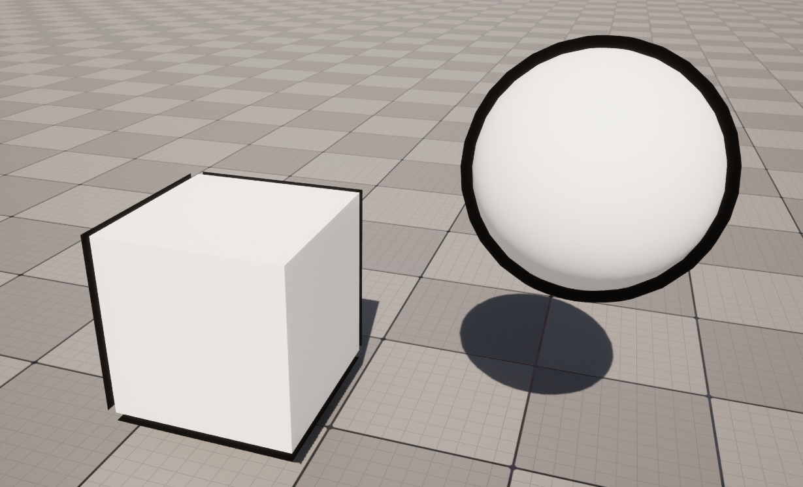

# ReverseHullToolkit

An Unreal Engine 5 plugin that allows to automatically create an outline using the Reverse Hull method

## Installation

clone the repository in a folder (`ReverseHullToolkit` name is suggested) and put that inside Plugins folder in your project (if there isn't one create it), then restart the editor.

## Usage

First make sure that the plugin is enabled; you can do that by going to Edit/Plugins, and in the Plugins window search for `ReverseHullToolkit`: the plugin is enabled when the tick is checked!

Lets take this simple case as example: you want to apply an outline to a sphere

Start by opening the toolkit tab, you will find it here 

After clicking on it the Toolkit Window will appear

Now Simply make a selection of the objects to which you want to apply the outline and press on Generate Outline.
The Tool will generate the hull for the outline and automatically place it under the selected object.

## Notes

You may have noticed a check box in the tab: that enables the mesh compacting step that addresses the problem that you see in the square outline.
Currently it is still not implemented so it will simply generate the simple hull instead.

As a rule of thumb you can use the simple hull process when the mesh does not have "holes", which means that every face shares one or more vertices with other faces.
